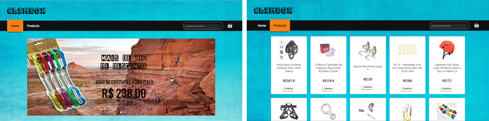

# Climbox
An e-commerce for climbing equipments.

## Motivation
It was the final project of the fifth sprint of Laboratoria bootcamp. The requirement was to create a SPA (Single Page Application), with free theme, consuming at least one API. 

Observing how much tech companies are using React, I set myself the challenge of learning and applying it in this project.

## Appearance

## Technology Stack
+ HTML5
+ CSS3
+ JavaScript 
+ React
+ Local Storage
+ [Mercado Livre API](https://developers.mercadolivre.com.br/) 

## Oficial Roadmap

#### versão 3.0.0 (scheduled for January 2019)
+ Allow the completion of the purchase through PayPal API.

#### version 2.0.0 (scheduled for November 2018)
+ Enable the search field on all pages;
+ Allow items to be excluded from the cart;
+ Code refactoring.

#### version 1.0.0 (released)
+ The home page has a fictional carousel with the main offers of the week, the products page, with cards of each item and the possibility to see details and buy it. In addition there is a search field and the cart where you can add items and see the total of the purchase.

